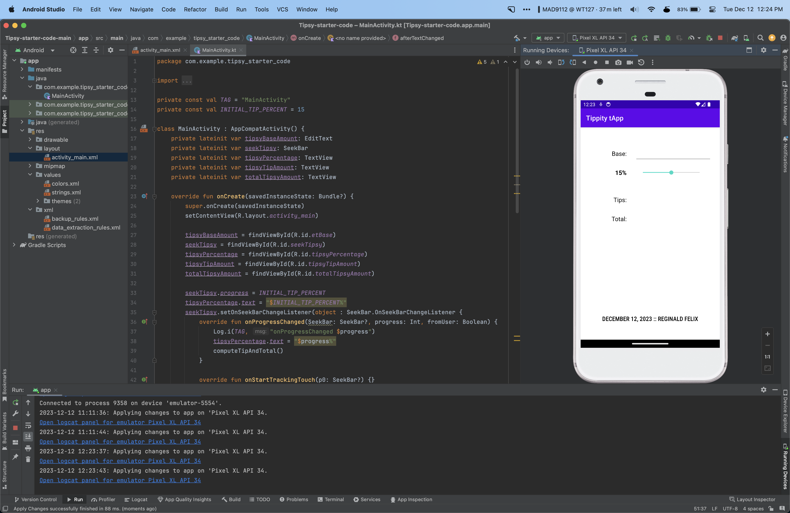
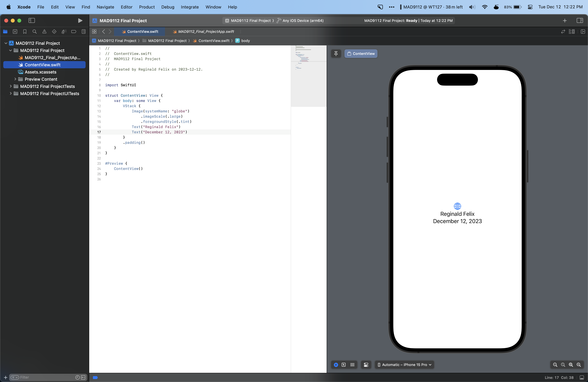

<h1>Reginald Felix</h1>

# **JavaScript Code**
```
let numArray = [23, 54, 67, 12, 40, 45, 21, 76];


function arrayAverage(data){
    let arrayAverage = 0;
    for (i = 0 ; i < data.length ; i++){
        arrayAverage += data[i] / data.length;
    }
    return arrayAverage;
}

console.log("The average is: " + arrayAverage(numArray));
```

# **Screenshots**


